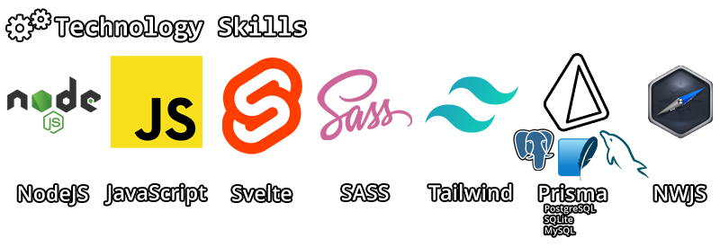

# Hello There! 🏍

I'm Joshua, a passionate and versatile Frontend developer, and I'm thrilled to have you visit my github profile. Here you'll find a digital canvas where I bring ideas to life through lines of code, creating unique and impactful web experiences.

## Feel free to visit my portfolio for projects showcasing my talents.

🔭 [thisjt.me/portfolio](https://thisjt.me/portfolio "thisjt.me Porfolio")

## You can also check my blog for code-related things that I find interesting.

🌱 [thisjt.me/blog](https://thisjt.me/blog "thisjt.me Blog")

- • •

🌐 [thisjt.me](https://thisjt.me "thisjt.me Personal Website") 📩 [reach out!](mailto:contact@thisjt.me)

<!--
**thisjt/thisjt** is a ✨ _special_ ✨ repository because its `README.md` (this file) appears on your GitHub profile.

Here are some ideas to get you started:

- 🔭 I’m currently working on ...
- 🌱 I’m currently learning ...
- 👯 I’m looking to collaborate on ...
- 🤔 I’m looking for help with ...
- 💬 Ask me about ...
- 📫 How to reach me: ...
- 😄 Pronouns: ...
- ⚡ Fun fact: ...
-->
